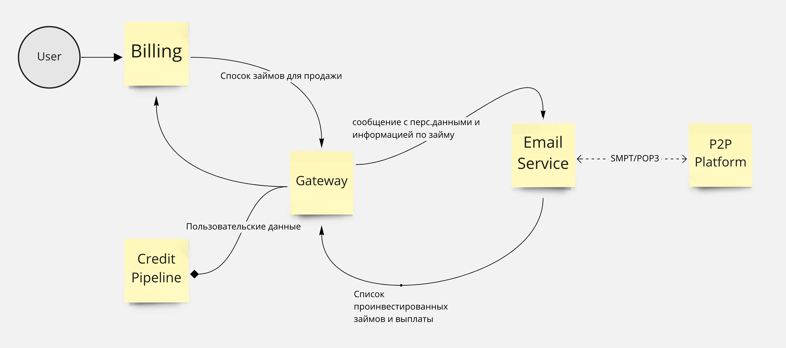

# Задание по тестированию интеграции с P2P платформой

## Задание

напишите план тестирования проекта

- общий подход к тестированию проекта
- что необходимо проверить в плане безопасности прользовательских данных
- какие вещи нуждаются в автоматизации тестирования что лучше тестировать вручную
- любая другая информация которая кажется ценной

## Описание проекта

### Тезаурус

- P2P Platform - Платформа для привелечения p2p инвестиций по выданным займам
- Billing - Биллинг займов, учет платежей, начисление процентов и пеней.
- Gateway - Сервис обмена данными с p2p платформой.
- Credit Pipeline - Кредитьный конвеер, хранит персданные для обработки Gateway запросов
- Email Service - облачный SMPT/POP3 сервер

### Инфраструктура

### Возможные события

- Передача займа на платформу
- Инвестирование P2P платформы в размещенные займы под процент
- Получение платежей от P2P платформы
- Оплата в P2P платформу процентов
- Выкуп займа
- Оплата в P2P платформу тела займа

### Описание рабочего места

- Загрузка списка займов для передачи на платформу. Можно из эксель, можно из табличного документа на форме (как в загрузке платежей списком)
- Отчет по сумме переданных на платформу займов, ставка (средняя), сколько суммарно процентов из этого куплено инвесторами. Вариант по дням, вариант в целом на текущий момент (условно - остатки). Сколько выкуплено.
- Отчет по состоянию займа на платформе (вывод всей аналитики по состоянию займа и его истории, чтобы в одном месте посмотреть корректность жизни займа на платформе)
